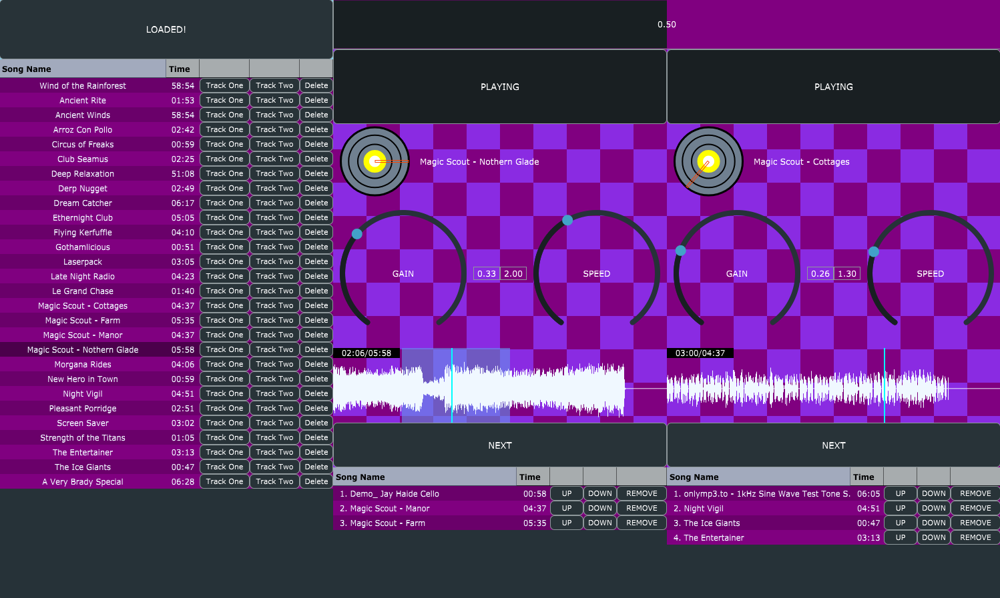

# DJ Player Using JUCE

Note: Does not include the JUCE library. You will need to download it from [here](https://shop.juce.com/get-juce/download) and add it to the project. (Tested with JUCE 7.0.5)

# What is this?

Made in April of 2022, this app was my first exposure to JUCE and more complex C++ coding. It is a simple DJ app that allows you to mix two songs together. It does have some bugs, but it was a great learning experience.

It was originally made as a University project with the guidance of my lecturer, this is a DJ App with two separate tracks that allow for gain control, pitch control, and a crossfader.

# How do I use it?

You will need to build the project using CMake and a JUCE distribution.

Upload songs to the playlist, and add them to the decks.

Then use the controls to mix the songs together.
